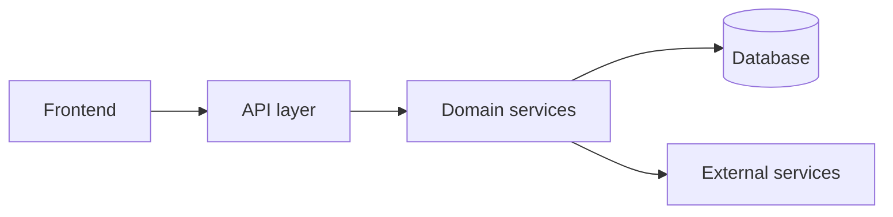

# Architecture — NoghreShop

> **Status:** draft · **Approved by:** — · **Last updated:** —
>
> **How to use this file.** The Architecture Agent owns it, written after requirements and the
> UX specification are approved. It is the **source of truth for how the system is built.**
> Module *boundaries and ownership* are not here — they are in `modules/<MODULE-ID>.md`.
>
> Architecture rules for this framework
> * Optimize explicitly for **independent, parallel agent development**: the decisive quality
>   attribute is how cleanly the system splits into modules with frozen interfaces.
> * Every hard-to-reverse choice gets an `ADR-###` entry in `docs/project/decisions.md`.
> * Interfaces are **frozen** before parallel implementation waves (`state/dependencies.yaml`
>   `status: frozen`). An unfrozen interface is a coordination hazard.
> * Define **shared zones** (files or directories more than one module would naturally touch)
>   and give each exactly one owner. Register them in `state/project.yaml → shared_zones`.
> * Tag: `[DECISION]`, `[REC]`, `[ASSUMPTION]`, `[OPEN]`, `[RISK]`, `[ADR-###]`.

---

## 1. Architectural overview
<!-- One diagram (Mermaid or ASCII) + one paragraph. Show the major runtime pieces and the
     direction of dependencies. Anyone should understand the shape in 60 seconds. -->



## 2. Quality attributes and trade-offs

| Attribute | Target | How the architecture achieves it | Trade-off accepted |
|---|---|---|---|
| Modularity / parallel work | | | |
| Testability in isolation | | | |
| Security | | | |
| Performance | | | |
| Scalability | | | |
| Operability | | | |
| Reversibility | | | |

## 3. Components and boundaries

| Component | Responsibility | Owns data | Depends on | Expected module |
|---|---|---|---|---|
| | | | | |

## 4. Module boundary preview

> Full contracts are produced by the Module Decomposition Agent. This section is the
> architectural intent that decomposition must respect.

| Proposed module | Purpose | Kind (library / service / UI / job) | Must not own |
|---|---|---|---|
| `AUTH-001` | | | |

### 4.1 Shared zones

| Zone | Why it is shared | Single owner | Rule |
|---|---|---|---|
| e.g. routing table | every UI module adds a route | `APP-001` | others request changes via the owner |
| e.g. dependency manifest | one file, many consumers | `APP-001` | new runtime dependency requires `ADR` + human |
| e.g. DB migrations | ordered, global | `DB-001` | one migration per module per wave |

## 5. Data model

### 5.1 Entities

| Entity | Fields | Owner module | Notes |
|---|---|---|---|

### 5.2 Relationships

### 5.3 Persistence choices
`[ADR-###]`

### 5.4 Migrations and evolution policy
<!-- Who writes migrations, how they are ordered, what is destructive, how rollback works. -->

## 6. Interfaces

> The contract list is the coordination backbone. Each interface states its shape, its owner and
> its consumers. Interfaces become `frozen` in `state/dependencies.yaml` before implementation
> waves start.

### 6.1 Internal interfaces (module ↔ module)

#### IF-AUTH-SERVICE `[DECISION]`
- **Kind:** library / HTTP / event / UI
- **Provided by:** `AUTH-001`
- **Consumed by:** `DASH-001`, `PROJECT-001`
- **Shape:**
  ```
  method / route / event: signature or payload schema
  ```
- **Errors:**
- **Versioning rule:**
- **Status:** draft / frozen

### 6.2 External interfaces (system ↔ outside world)
| Interface | Direction | Format | Auth | Rate limits | Failure behaviour |
|---|---|---|---|---|---|

### 6.3 Frontend ↔ backend
| Concern | Decision |
|---|---|
| Data fetching model | |
| Error/loading contract | |
| Auth/session transport | |
| Realtime (if any) | |

## 7. Authentication and authorization

- **Authentication model** `[ADR-###]`
- **Session/token strategy:**
- **Authorization model** (roles/permissions, where enforced):
- **Permission matrix:**

| Role | Resource | Action | Enforced in |
|---|---|---|---|

- **Secrets and key management:**
- **Threat notes:** see §9 and `docs/workflows/security.md`

## 8. Observability

| Signal | What we record | Where it goes | Retention |
|---|---|---|---|
| Logs | | | |
| Metrics | | | |
| Traces | | | |
| Audit events | | | |
| Frontend errors | | | |

## 9. Security model

| Concern | Decision | Reference |
|---|---|---|
| Trust boundaries | | |
| Input validation | | |
| Authorization enforcement points | | |
| Data at rest / in transit | | |
| Sensitive data inventory | | `docs/project/requirements.md#43-privacy-and-compliance` |
| Dependency/supply-chain policy | | `docs/project/conventions.md` |
| Agent access to systems | | `docs/workflows/security.md` |

## 10. Deployment and infrastructure

| Environment | Purpose | Hosting | Data | Deploy trigger |
|---|---|---|---|---|
| local | developer + agent sandbox | | local only | — |
| staging | integration validation | | anonymised | merge to default branch |
| production | real users | | real | manual human approval |

- **Build/release pipeline:**
- **Configuration and secrets injection:**
- **Rollback strategy:**
- **Cost notes:**

## 11. Testing architecture

> What must be testable *without* the rest of the system, and how. This is what makes
> independent module development possible.

| Layer | Scope | Tooling | Required in CI | Owner |
|---|---|---|---|---|
| Unit | inside one module | | yes | module agent |
| Contract | interface conformance | | yes | module + integration agent |
| Integration | module ↔ module | | yes | integration agent |
| End-to-end | user workflow | | yes (smoke) | integration agent |
| Visual/UX | rendered UI | `docs/ux/visual_validation.md` | for UI changes | frontend/UX agent |
| Performance | NFR targets | | on demand | architecture agent |
| Security | scans + authz tests | | weekly | human |

- **Test data strategy:**
- **Fixtures/factories ownership:**
- **Flaky-test policy:**

## 12. External dependencies

| Dependency | Purpose | Version policy | Replaceable? | Risk |
|---|---|---|---|---|

## 13. Performance and scalability

| Concern | Target | Design response | Verification |
|---|---|---|---|

## 14. Decision index

| ADR | Title | Status | Date |
|---|---|---|---|
| `ADR-001` | | accepted | |

## 15. Open architectural questions

| ID | Question | Blocks | Owner |
|---|---|---|---|
| `OQ-###` | | | |
