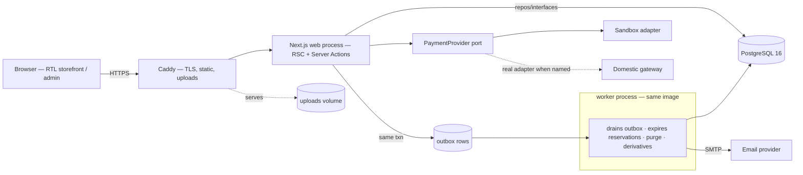

# Architecture — NoghreShop

> **Status:** in review · **Approved by:** — (`gates.architecture_approved` pending) · **Last updated:** 2026-09-21
>
> **How to use this file.** The Architecture Agent owns it. It is the **source of truth for how the
> system is built.** Module *boundaries and ownership* are not here — they are in `modules/<MODULE-ID>.md`.
>
> Architecture rules for this framework
> * Optimize explicitly for **independent, parallel agent development**: the decisive quality
>   attribute is how cleanly the system splits into modules with frozen interfaces.
> * Every hard-to-reverse choice gets an `ADR-###` entry in `docs/project/decisions.md`.
> * Interfaces are **frozen** before parallel implementation waves (`state/dependencies.yaml`
>   `status: frozen`). An unfrozen interface is a coordination hazard.
> * Define **shared zones** and give each exactly one owner. Registered in
>   `state/project.yaml → shared_zones`.
> * Tag: `[DECISION]`, `[REC]`, `[ASSUMPTION]`, `[OPEN]`, `[RISK]`, `[ADR-###]`.

---

## 1. Architectural overview

One TypeScript deployable (`ADR-001`): the Next.js process renders the storefront and the admin, the
worker is the same image under a second entrypoint, and everything shares one PostgreSQL database
(`ADR-002`). Mutations are Server Actions / form posts; the monthly theme and all first-paint HTML are
resolved server-side (`ADR-007`); notifications and scheduled work go through a database outbox
(`ADR-008`); payment is an internal port with a sandbox adapter until the gateway is named (`ADR-004`).

## 2. Quality attributes and trade-offs

| Attribute | Target (source) | Design response | Traded away |
|---|---|---|---|
| Agent-parallelism | framework rule | feature modules behind single-file barrels; repos as seams; shared zones minimised and owned | some cross-module convenience (no shared entity imports) |
| Money correctness | `BR-4`, `DEC-016`, `DEC-020` | server-side pricing from the current rate; price basis frozen on the order; DB constraints on invariants | instant client-side price display (recomputed per visit) |
| Owner-operability | `NFR-MAINT-1`, `DEC-030` | one VPS, compose, admin covers every operation, failure panel in admin (`ADR-009`) | managed platform comfort |
| Performance | `NFR-PERF-1`, `NFR-SCALE-1` | RSC first paint, no client data waterfall, image derivatives, month-keyed caching | client-side interactivity breadth (only where UX demands it) |
| Accessibility / RTL | `NFR-A11Y-1`, `UX-G-*` | SSR HTML, logical properties, real text, keyboard-first patterns from the UX spec | — |
| Cost | `DEC-030` | open-source stack, free TLS, no paid APM/SaaS (`ADR-009`) | hosted error-tracking ergonomics |
| Privacy | `NFR-PRIV-1` | minimal data, on-box logs, no cross-border processors | offshore analytics (none) |

## 3. Components and boundaries

Components are runtime/ownership pieces; the Decomposition Agent turns them into `MODULE-ID`s.

| Component | Responsibility | Data ownership | Proposed module boundary |
|---|---|---|---|
| FOUNDATION | build harness, TS/ESLint config, Prisma schema + migrations, CI workflows, test fixtures seed | `prisma/**`, root configs | `FOUNDATION` (bootstrap wave, before parallel work) |
| SHELL | root layout, tokens (`tokens.css`), Farsi/format helpers (`src/lib/fa.ts`), theme resolution, health endpoint, logging setup | layout, tokens, fa lib | `SHELL` |
| CATALOG | categories, products, images metadata, product queries, pricing read-model | `products`, `categories`, `product_images` | `CATALOG` |
| RATE | daily silver rate: entry, history, current-rate read, staleness flag | `rates` | `RATE` |
| MEDIA | upload handling, validation, derivatives (sharp), serving integration with Caddy | `uploads` volume, `product_images` rows (with CATALOG) | `MEDIA` |
| CART | session cart, merge on login, server-side price computation | `carts`, `cart_items` | `CART` |
| CHECKOUT | checkout flow, stock reservation + expiry, promo application, order draft | `reservations`, checkout state on `carts` | `CHECKOUT` |
| PAYMENT | `PaymentProvider` port + sandbox adapter; later real adapters; callbacks/IPN | `payment_attempts` | `PAYMENT` |
| ORDERS | order lifecycle (forward-only), order history/tracking, price-basis freeze | `orders`, `order_items`, `order_events` | `ORDERS` |
| IDENTITY | sessions, guest identity, optional accounts (phone+password), login/register/reset | `accounts`, `sessions`, `credentials` | `IDENTITY` |
| ADMIN | admin shell, order management screens, product screens, rate/promo/featured/pages screens, failure panel | — (screens over other components' data; writes go through their interfaces) | `ADMIN` |
| NOTIFY | outbox drain, email transport, retry/backoff, duplicate suppression | `outbox` | `NOTIFY` |
| OPS | Dockerfile, compose, Caddyfile, deploy/backup scripts, env template | infra files | `OPS` |

Dependency direction: `ADMIN → (interfaces of)` catalog/rate/orders/payment/notify; domain modules
never import each other's internals — only barrels (`src/<module>/public.ts`). `FOUNDATION` is
upstream of everything; `SHELL` wraps all screens.

## 4. Module boundary preview

| Provisional ID | Wave | Why this wave |
|---|---|---|
| `FOUNDATION` | 0 | everything compiles/test-runs against it |
| `SHELL` | 0 | layout + tokens needed by every screen |
| `CATALOG` + `RATE` | 1 | browse needs products + prices; admin rate entry is its smallest vertical slice |
| `IDENTITY` + `CART` | 1 | cart must exist before checkout; identity is thin in v1 |
| `CHECKOUT` + `PAYMENT` + `ORDERS` | 2 | the money path, after cart and catalog freeze |
| `MEDIA` + `ADMIN` + `NOTIFY` | 2–3 | admin screens and notifications over frozen interfaces |
| `OPS` | 0 (files) / continuous | compose + CI exist from bootstrap; hardened at release |

Final IDs, contracts and waves are the Decomposition Agent's output (`agents/decomposition/STARTER_PROMPT.md`).

### 4.1 Shared zones

Declared in `state/project.yaml → shared_zones` (16 entries, owners `FOUNDATION` / `SHELL` / `OPS`):
dependency manifests and lockfile, TS/ESLint/Next config, Prisma schema + migrations, root layout,
`tokens.css`, `src/lib/fa.ts`, compose/Dockerfile/Caddyfile, CI workflows, `.env.example`. Rule:
the owner writes; everyone else requests a change (`docs/workflows/parallelism.md` §4).

## 5. Data model

### 5.1 Entities

| Entity | Key fields | Owner | Sensitivity / retention |
|---|---|---|---|
| `categories` | id, slug (unique), name, sort, parent_id | CATALOG | public · life of shop |
| `products` | id, slug (unique), name, category_id, weight_grams, labour_cost, stone_flag, stone_type (`moonstone`\|…), stock_qty, active, description | CATALOG | public · life of shop |
| `product_images` | id, product_id, path, width, height, alt, sort | MEDIA/CATALOG | public · life of shop |
| `rates` | date (unique), price_per_gram, recorded_at, recorded_by | RATE | business · keep all (audit) |
| `carts` / `cart_items` | session/account ref, product_id, qty, created_at | CART | pseudonymous · purge after 90 days inactive |
| `reservations` | cart_id, product_id, qty, expires_at | CHECKOUT | ephemeral · worker expiry |
| `orders` | code (unique, public), account_id?, contact {name, phone, address, email?}, status (`paid→shipped→delivered`), totals, **price basis** (rate, rate_date, items snapshot) | ORDERS | personal · keep 10 years (tax), anonymise contact on request |
| `order_items` | order_id, product_id, name/weight snapshot, unit price basis, labour | ORDERS | as orders |
| `order_events` | order_id, from→to status, at, actor, correlation_id | ORDERS | audit · keep |
| `payment_attempts` | order_id, provider_ref, amount, status, idempotency_key, raw_ref | PAYMENT | provider refs only — never card data · keep |
| `accounts` / `credentials` | phone (unique), name, email?, argon2 hash | IDENTITY | personal · deletable on request (`NFR-PRIV-1`) |
| `sessions` | id, kind (guest/account/admin), account_ref?, created/expires, revoked_at | IDENTITY | pseudonymous · expire 30 d |
| `promos` / `promo_redemptions` | code, percent, max_uses, expires_at / order_id, promo_id | CHECKOUT | business · keep |
| `outbox` | id, kind, payload, status, attempts, next_attempt_at, last_error | NOTIFY | internal · purge sent after 30 d |
| `settings` | key (unique), value — rate-banner dismissal, featured product (`DEC-043`), hero content (`DEC-047`) | ADMIN | internal · life of shop |
| `pages` | slug, title, body — policy pages, story (`SCR-010`) | ADMIN | public · life of shop |

### 5.2 Relationships

`category 1—n product 1—n product_image` · `cart 1—n cart_item n—1 product` · `order 1—n order_item`,
`order 1—n order_event`, `order 1—n payment_attempt` · `account 1—n session` · `promo 1—n
promo_redemption n—1 order`.

### 5.3 Persistence choices

PostgreSQL 16 via Prisma (`ADR-002`). Money in **integer Rials/Tomans** (no floats); weights in
milligrams-precision integers; timestamps `timestamptz` UTC, displayed Jalali (`design_system.md` §6).
DB-enforced invariants: unique order `code`, unique `rates.date`, unique active promo code,
`CHECK (stock_qty >= 0)`; status transitions enforced in the ORDERS domain layer (forward-only) and
guarded by a DB trigger as a second line of defence.

### 5.4 Migrations and evolution policy

`prisma/migrations/**` is a shared zone owned by `FOUNDATION`: one author per wave, migrations are
numbered and forward-only, every migration is reviewed with its PR, and **destructive or
data-moving migrations need human approval**. Expand → migrate → contract for any breaking change;
never edit an applied migration.

## 6. Interfaces

### 6.1 Internal interfaces (module ↔ module)

| Interface (barrel export) | Kind | Shape (summary) | Errors | Versioning | Provider | Consumers | Conformance test |
|---|---|---|---|---|---|---|---|
| `catalog.public` | TS library | `findProducts(query) → Page<ProductCard>`; `getProduct(slug)`; `listCategories()` | typed result unions (`notFound`, `unavailable`) | additive only; freeze at wave 1 | CATALOG | CART, CHECKOUT, ADMIN, screens | contract test in CATALOG |
| `rate.public` | TS library | `currentRate() → {pricePerGram, date}` · `staleness()` · `recordRate(date, value, actor)` | `RateMissing`, `InvalidRate` | additive; freeze at wave 1 | RATE | CATALOG (pricing), ADMIN | contract test |
| `pricing.compute` | pure fn | `priceFor(item, rate) → {total, basis}` — **pure**, no I/O | `InvalidInput` | frozen at wave 1 (money) | CATALOG | CART, CHECKOUT, ORDERS | property/unit tests (rounding) |
| `cart.public` | TS library | `getCart(sessionRef)`, `addItem`, `updateQty`, `merge(onLogin)` | `ProductGone`, `QtyClamped` | additive; freeze at wave 1 | CART | CHECKOUT, ADMIN | contract + integration |
| `checkout.public` | TS library | `startCheckout(cartId)`, `attachContact`, `applyPromo`, `placeOrder()` → `OrderDraft` | `ReservationExpired`, `PromoInvalid`, `PriceChanged` | freeze at wave 2 | CHECKOUT | ADMIN | contract + integration |
| `payment.PaymentProvider` | **port** | `createPayment(intent) → {redirectUrl}`; `verifyCallback(params) → Verified` | `ProviderError`, `VerificationFailed`, `DuplicateCallback` | frozen at wave 2 | PAYMENT | CHECKOUT, worker | provider conformance suite (`ADR-004`) |
| `orders.public` | TS library | `place(draft)`, `advance(orderId, to, actor)` (forward-only), `findByCode+phone`, `listFor(account)` | `InvalidTransition`, `NotFound` | freeze at wave 2 | ORDERS | CHECKOUT, ADMIN, NOTIFY | contract + state-machine test |
| `notify.enqueue` | TS library | `enqueue(kind, payload)` — same-txn as caller's write | never throws (outbox) | additive; freeze at wave 2 | NOTIFY | ORDERS, ADMIN | integration (same-txn assert) |
| `identity.session` | TS library | `getSession()`, `createGuest()`, `signIn()`, `signOut()`, `requireAdmin()` | `Unauthenticated` | additive; freeze at wave 1 | IDENTITY | all screens, ADMIN | integration |
| `media.put` | TS library | `saveUpload(file, meta) → {path, derivatives}` | `UnsupportedType`, `TooLarge` | additive; freeze at wave 2 | MEDIA | ADMIN | contract + unit |

### 6.2 External interfaces (system ↔ outside world)

| Interface | Direction | Contract | Failure behaviour |
|---|---|---|---|
| Gateway (domestic) | outbound + callback | behind the port (`ADR-004`); server-side verification before `paid`; idempotent callbacks | attempt rows keep state; failures visible in admin (`ADR-009`) |
| SMTP | outbound | worker-only (`ADR-008`); retries with backoff; duplicate suppression per (order, event) | dead-letter state in admin; never blocks the caller's txn |
| Browser | bidirectional | progressive enhancement: every mutation is a form post / Server Action that works without JS | no-JS e2e run of `UF-02` |

### 6.3 Frontend ↔ backend

- **Rendering:** React Server Components render all first-paint HTML; the monthly theme is resolved
  server-side into `data-month` + CSS custom properties (`ADR-007`). No client data fetching on first
  paint; client components are interaction islands only.
- **Mutations:** Server Actions for same-app writes, plus real `POST` endpoints where a no-JS fallback
  is required (buying path). Validation with zod at the boundary (`conventions.md` §2).
- **State contract:** every async region renders the four states the UX spec demands — loading
  (skeleton in the RSC stream), empty, error (Farsi actionable message, `UX-G-003`), success.
- **Auth transport:** httpOnly signed cookies only (`ADR-005`); no tokens in localStorage.
- **Caching:** product/category pages cached with a **month key** + revalidate at the day boundary
  (`ADR-007`); cart/checkout/admin are dynamic; static assets immutable-hash filenames.

## 7. Authentication and authorization

`ADR-005`. Guests: signed httpOnly session cookie → cart/checkout. Accounts (optional): phone unique +
argon2id password; admin: separate principal, separate cookie namespace, own login screen, TOTP
recommended. Enforcement is **server-side in the owning module** (`conventions.md` §6):

| Action | Who | Enforced in |
|---|---|---|
| browse / cart / checkout | anyone (guest) | public routes; cart keyed to session |
| view own orders (`/account`) | account owner | IDENTITY session + ORDERS query scoped by account |
| track an order | code + phone match (`DEC-021`) | ORDERS (not a session right) |
| admin: any `/admin/**` | admin principal | IDENTITY `requireAdmin()` at layout + per-action check; UI is not the boundary (IA §5) |
| advance order status / record rate / edit products | admin | ORDERS / RATE / CATALOG interfaces take `actor` and re-check role |
| payment callbacks | gateway (verified) | PAYMENT signature/verification + rate limit |

Rate limiting on both login screens, on order tracking, and on payment callbacks (in-memory at v1
scale, documented as a single-box assumption). CSRF: `SameSite=Lax` cookies + Server Actions' built-in
origin check; pure form-post endpoints additionally verify the origin header. Lockout after repeated
failures; all auth events logged without personal data.

## 8. Observability

`ADR-009`. Structured JSON logs to stdout (rotated, 30-day retention) with a correlation id per
request (`x-request-id` propagated to outbox rows and order events); no secrets, no personal data.
`/healthz` (process + DB check) for an uptime monitor. The **admin failure panel** lists unresolved
failures — outbox dead letters, payment verification failures, worker errors — each with a retry
action; this is the owner's primary surface (`NFR-OBS-1`). A daily summary line in admin shows
yesterday's failure count. Frontend errors surface through the same panel via a lightweight
server-received beacon (no third-party script).

## 9. Security model

- **Trust boundaries:** browser ↔ Caddy (TLS, `ADR-003`); Caddy ↔ Next (private network); app ↔ DB
  (credentials via env); app ↔ gateway/SMTP (outbound, secrets via env); admin ↔ internet (session +
  TOTP). Nothing trusts the client: authorization, pricing, and stock are server facts.
- **Secrets:** environment variables only; `.env` gitignored, `.env.example` lists every key; on the
  server the file is root-readable; never logged (`conventions.md` §6).
- **Card data:** none, by construction (`NFR-SEC-1`, `ADR-004`) — checkout redirects to the gateway;
  the store keeps only provider references and amounts.
- **Personal data:** minimal by design (`NFR-PRIV-1`); erasure on request = anonymise order contact +
  delete account/credentials rows (order/financial records retained, contact fields replaced) —
  executed from the admin, logged to `order_events`. Retention table in §5.1.
- **Uploads:** type sniffing (not extension), size cap, derivative generation, stored outside the web
  root, served by Caddy with `Content-Disposition: attachment`-safe headers and no execution.
- **Headers:** Caddy sets HSTS, `X-Content-Type-Options`, `Referrer-Policy`, CSP (report-only first,
  then enforce — an `OPS` task in the release wave).
- **Agent-facing rules:** per `docs/workflows/security.md` — least-privilege tokens, no production
  credentials to agents, destructive ops need human approval.

## 10. Deployment and infrastructure

`ADR-003`. One domestic VPS (2 vCPU / 4 GB class), Docker Compose services: `edge` (Caddy), `web`,
`worker`, `db` (Postgres, named volume), uploads volume. Images built in CI and pushed to the
container registry (`OQ-017` covers registry reachability from Iran); deploy =
`docker compose pull && docker compose up -d` (health-checked, old images kept for rollback).
Backups: nightly `pg_dump` retained 14 days + volume snapshot before each deploy; **restore drill
once before launch** (DoD level 4). Environments: local dev (compose `db` + `db-test`) and production;
a staging box is a `[REC]` deferred as unnecessary at this scale — the sandbox payment adapter makes
production-safe rehearsals possible. Cost (monthly): VPS + domain only; TLS free (Let's Encrypt),
no paid SaaS.

## 11. Testing architecture

`ADR-010`. Isolation is the point: **every domain module is testable without any other module and
without a browser** — pure functions for pricing/transitions, repository interfaces over a disposable
Postgres, the payment port over the sandbox adapter, the outbox over the real table.

| Level | What | Tooling | In CI |
|---|---|---|---|
| Unit | domain logic, pricing rounding, state machine, fa/format helpers, adapters with fakes | Vitest | yes |
| Integration | repositories, outbox same-txn, reservation expiry, session flows — real Postgres (`db-test`), truncated per test | Vitest + containers | yes |
| Contract | one per provided interface (§6.1), provider conformance for the payment port | Vitest | yes |
| E2E | `UF-01`…`UF-04` incl. payment failure, no-JS buying path, RTL keyboard walkthrough; screenshots at 320/768/1280 (`visual_validation.md`) | Playwright | yes |
| A11y / theme | axe scan on changed screens; twelve-accent contrast + `data-month` integrity (`UX-AC-012.1`) | Playwright + Vitest | yes |
| Security | dependency audit; (gitleaks when CI secrets exist) | npm audit | yes |

Test data: factories owned by the module that defines the entity; a seeded fixture set for e2e; **no
production data in tests** (`NFR-PRIV-1`). Flaky test policy: fix or quarantine with an issue — never
retry in silence (`conventions.md` §3).

## 12. External dependencies

| Dependency | Purpose | Version policy | Replaceable? | Risk |
|---|---|---|---|---|
| next / react / react-dom | app framework, RSC | Node 22 LTS; minor upgrades via Dependabot PRs | low (framework-bound) | churn between majors — upgrade deliberately |
| typescript, eslint, prettier | toolchain | pinned devDeps | high | — |
| prisma / @prisma/client | data access + migrations | pinned; client generated, never committed | moderate (repository seam) | schema is the real lock-in (`ADR-002`) |
| zod | boundary validation | pinned | high | — |
| argon2 (node-argon2) | password hashing | pinned; native build needs toolchain on the image | low | image build complexity |
| nodemailer | SMTP transport | pinned | high | provider choice at launch (`OQ-018`) |
| sharp | image derivatives | pinned | moderate | native binary in image |
| vitest, playwright | test toolchain | pinned devDeps | moderate | browser download in CI (`OQ-017`) |
| CSS custom properties + CSS Modules | styling | — (no CSS framework: the token file stays authoritative, `ADR-007`) | — | none |

New runtime dependency ⇒ `ADR-###` + human approval (`conventions.md` §4). Lockfile committed.

## 13. Performance and scalability

| Concern | Target | Design response | Verification |
|---|---|---|---|
| Core pages interactive | < 3 s mid-range mobile (`NFR-PERF-1`) | RSC first paint, no client waterfall, ≤ ~150 KB JS on storefront pages | Lighthouse budget in CI on `SCR-001`/`SCR-004` |
| CLS | ≈ 0 (`UX-G-007`) | SSR with fixed aspect-ratio media, font swap policy, colour-only theme rollover | Playwright CLS assert |
| Spike ×5 (500–5,000 visitors/day) | no degradation (`NFR-SCALE-1`) | cached catalog pages, DB indexes on slug/code/status, one-box headroom | load test at spike profile before launch |
| Images | fast gallery, cheap storage | sharp derivatives per breakpoint, lazy loading, served by Caddy | e2e timings |
| DB | p95 queries < 50 ms at this scale | indexes (product slug, order code, order status, outbox next_attempt), no N+1 through barrels | integration timing assertions |
| Scale-out path | if needed later | bigger VPS first; then read replica / managed Postgres — the repository seam keeps options open | — |

## 14. Decision index

| ADR | Title | Status | Date |
|---|---|---|---|
| `ADR-001` | Modular monolith: TypeScript end-to-end on Next.js (App Router) | accepted | 2026-09-21 |
| `ADR-002` | PostgreSQL 16 + Prisma for schema and ordered migrations | accepted | 2026-09-21 |
| `ADR-003` | One domestic VPS, Docker Compose, Caddy TLS | accepted | 2026-09-21 |
| `ADR-004` | Payment boundary: internal port + sandbox adapter | accepted | 2026-09-21 |
| `ADR-005` | Guest-first sessions, optional phone+password, separate admin session | accepted | 2026-09-21 |
| `ADR-006` | Cart/checkout state server-side | accepted | 2026-09-21 |
| `ADR-007` | Monthly theme resolved server-side (`data-month` + CSS custom properties) | accepted | 2026-09-21 |
| `ADR-008` | Notifications via DB outbox + worker | accepted | 2026-09-21 |
| `ADR-009` | Structured logs + admin failure surface; no paid APM | accepted | 2026-09-21 |
| `ADR-010` | Vitest + real Postgres container + Playwright evidence | accepted | 2026-09-21 |

Full records in `docs/project/decisions.md`.

## 15. Open architectural questions

| ID | Question | Blocks | Owner |
|---|---|---|---|
| `OQ-017` | Container registry reachable from the Iranian VPS, or build-on-server? CI runner (GitHub-hosted cannot reach the box for deploy) | `OPS` deploy path, CI credentials | human (with `OPS`) |
| `OQ-018` | Which domestic SMTP/email provider, and its sending limits? | `NOTIFY` transport config, email copy tests | human |
| `OQ-019` | SMS/OTP provider — deferred with `ADR-005`/`ADR-008`; confirm it stays out of v1 | nothing in v1 | human |
| `OQ-020` | Off-box backup copy (object storage or manual download policy)? Restores are on-box today | release drill, disaster recovery | human |
| `OQ-021` | Domain, DNS and TLS provider (domestic, Let's Encrypt reachable?) + admin TOTP device choice | launch readiness | human |
