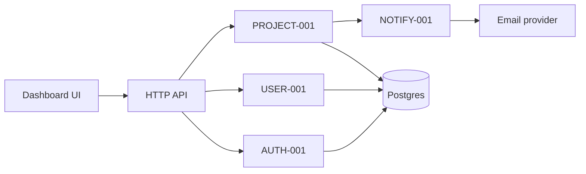

# Architecture — Example SaaS

> **Status:** approved · **Last updated:** 2026-03-06 (abridged reference)

## 1. Architectural overview



A modular monolith: one deployable, internally split into modules with explicit interfaces. Chosen
for agent-parallelism and operational cost (`ADR-001`).

## 2. Quality attributes and trade-offs

| Attribute | Target | How | Trade-off |
|---|---|---|---|
| Modularity / parallel work | five independently testable modules | ports + interfaces, no cross-module imports | a little indirection |
| Testability in isolation | module tests run without the app | in-memory repositories in tests | test doubles to maintain |
| Security | server-side authz everywhere | single `requirePermission` seam | more wiring |
| Performance | `NFR-PERF-1` | indexed queries, no N+1 | index maintenance |
| Reversibility | cheap to split later | module boundaries mirror a future service split | none material |

## 3. Components and boundaries

| Component | Responsibility | Owns data | Depends on | Expected module |
|---|---|---|---|---|
| Auth | signup/signin/session/reset | Session, reset token | User read port | `AUTH-001` |
| Users | profiles, collaborator roles | User | — | `USER-001` |
| Projects | project lifecycle, attention rules | Project | User read, Notification port | `PROJECT-001` |
| Dashboard | composition and presentation of attention + activity | — (read models) | Projects read, Users read | `DASH-001` |
| Notifications | notification records + delivery | Notification | User read, email provider | `NOTIFY-001` |

## 4. Module boundary preview

| Proposed module | Purpose | Kind | Must not own |
|---|---|---|---|
| `AUTH-001` | authentication and session lifecycle | library + HTTP routes | user profile data |
| `USER-001` | profiles and collaborator roles | library + HTTP routes | passwords, tokens |
| `PROJECT-001` | project lifecycle and attention rules | library + HTTP routes | notifications delivery |
| `DASH-001` | dashboard composition and UI | UI + read model | writing project data |
| `NOTIFY-001` | notification records and email delivery | library + job | project rules |

### 4.1 Shared zones

| Zone | Why shared | Single owner | Rule |
|---|---|---|---|
| `src/app/routes.ts` | every module adds routes | `APP-001` (app shell) | modules request additions; owner edits |
| `package.json` | one dependency manifest | `APP-001` | new runtime dependency requires an ADR |
| `db/migrations/**` | ordered migrations | `DB-001` | one migration per module per wave |
| `src/app/design-tokens.css` | visual consistency | `DASH-001` (tokens) | Frontend/UX decides, one writer |

## 5. Data model

| Entity | Fields that matter | Owner | Invariants |
|---|---|---|---|
| User | id, email (unique), displayName, timezone | USER-001 | email uniqueness case-insensitive |
| Session | id, userId, expiresAt, revokedAt | AUTH-001 | expired or revoked ⇒ invalid |
| ResetToken | id, userId, tokenHash, expiresAt, usedAt | AUTH-001 | single use, 30 min expiry |
| Project | id, ownerId, name, status, dueDate, archivedAt | PROJECT-001 | owner must exist; name non-empty |
| Membership | projectId, userId, role | PROJECT-001 | unique (projectId, userId) |
| Notification | id, userId, kind, payload, readAt | NOTIFY-001 | at most one per (userId, kind, payload key) |

**Migration policy:** `DB-001` owns ordering; destructive changes require human approval and a
rollback plan.

## 6. Interfaces

### 6.1 Internal interfaces (module ↔ module)

#### IF-USER-PORT `[DECISION]` `[ADR-001]`
- **Kind:** library
- **Provided by:** `USER-001`
- **Consumed by:** `AUTH-001`, `PROJECT-001`, `NOTIFY-001`
- **Shape:**
  ```
  getUser(userId: string): Promise<User | null>
  getUserByEmail(email: string): Promise<User | null>
  ```
- **Errors:** returns `null` for a missing user; throws only on infrastructure failure
- **Consumers must not:** read the users table directly, or assume a non-null result
- **Versioning:** additive changes only; removals require a change request
- **Status:** frozen

#### IF-PROJECT-READ `[DECISION]`
- **Kind:** library
- **Provided by:** `PROJECT-001`
- **Consumed by:** `DASH-001`
- **Shape:**
  ```
  listProjectsForUser(userId): ProjectSummary[]
  listAttentionItems(userId, withinDays): AttentionItem[]   // overdue + due soon, urgent first
  listRecentActivity(userId, limit): ActivityEvent[]         // newest first, limit ≤ 50
  ```
- **Errors:** never throws for an empty result; throws on infrastructure failure
- **Status:** frozen

#### IF-NOTIFY-PORT `[DECISION]`
- **Kind:** event subscription (deliberately **not** an import dependency)
- **Emitted by:** `PROJECT-001` as `EV-PROJECT-ASSIGNED`
- **Provided by / subscribed by:** `NOTIFY-001` (subscriber wired by the app shell)
- **Shape:**
  ```
  EV-PROJECT-ASSIGNED { projectId, assigneeUserId, actorUserId, projectName, eventKey }
  ```
- **Delivery guarantee:** at-most-once per (assignee, project, eventKey); a notification failure can
  never fail the emitting command (`AC-FR-NOTIF-1.2`)
- **Status:** frozen

#### IF-AUTH-SESSION
- **Kind:** library
- **Provided by:** `AUTH-001`
- **Consumed by:** `DASH-001`, `PROJECT-001` (via middleware)
- **Shape:** `requireSession(request): Promise<SessionContext | null>`
- **Status:** frozen

### 6.2 Frontend ↔ backend
| Concern | Decision |
|---|---|
| Data fetching | server-rendered shell + typed fetch for mutations |
| Error/loading contract | each route returns `{ data | error: { code, message } }`; UI maps codes to copy |
| Session transport | httpOnly cookie, `SameSite=Lax`; no token in JavaScript |

## 7. Authentication and authorization
- **Authentication:** argon2id password hashes; opaque session cookie (`NFR-SEC-1`); reset tokens are
  random 32-byte values stored hashed `[ADR-002]`.
- **Authorization:** every project route calls `requireProjectAccess(userId, projectId, action)`;
  BR-2 enforced there, never in the UI.
- **Secrets:** `SESSION_SECRET`, database URL and email API key come from the environment.

## 9. Security model
| Concern | Decision |
|---|---|
| Trust boundary | browser is untrusted; all authorization server-side |
| Input validation | at the HTTP boundary, per route schema |
| Sensitive data | email/name (PII), tokens (secret, hashed) |
| Agent access | dev/test credentials only; no production access |

## 10. Deployment
| Environment | Hosting | Data | Trigger |
|---|---|---|---|
| local | developer machine | seeded synthetic | — |
| staging | single container | synthetic | merge to `main` |
| production | managed platform | real | manual approval |

## 11. Testing architecture
| Layer | Scope | Required in CI |
|---|---|---|
| Unit | inside one module | yes |
| Contract | `IF-USER-PORT`, `IF-PROJECT-READ`, `IF-NOTIFY-PORT`, `IF-AUTH-SESSION` | yes |
| Integration | auth → users → projects | yes |
| E2E | UF-01, UF-02 (signup, dashboard attention) | yes (smoke) |
| Visual | dashboard + sign-in screens | for UI changes |
| Performance | `NFR-PERF-1`, `NFR-PERF-2` | before release |

## 12. External dependencies
| Dependency | Purpose | Version policy | Replaceable |
|---|---|---|---|
| Postgres | primary store | pinned minor | via repository interfaces |
| argon2 | password hashing | pinned | yes (ADR required) |
| email provider | reset + digest | pinned | yes (behind port) |

## 14. Decision index
| ADR | Title | Status |
|---|---|---|
| ADR-001 | Modular monolith with interface ports | accepted |
| ADR-002 | Opaque session cookies and hashed reset tokens | accepted |
